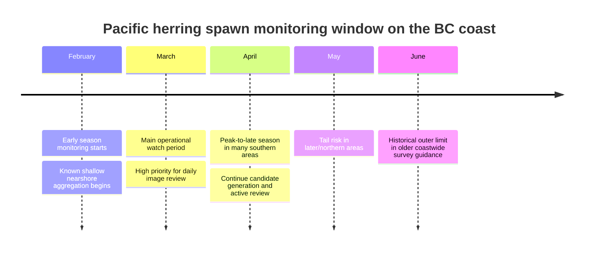
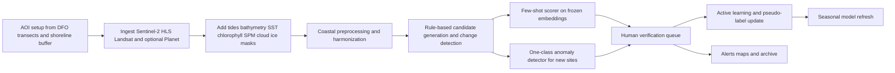

# Building a Satellite System to Detect Pacific Herring Spawn on British Columbia’s Coast

## Executive summary

For a practitioner starting with only **20 positive labelled samples**, the highest-probability path is **not** to begin with a fully supervised deep detector. Pacific herring spawn on the British Columbia coast is a **shoreline-attached, short-season, optically complex coastal event** whose most satellite-visible manifestation is usually **milt-driven water discolouration** rather than direct detection of eggs. DFO survey guidance and biological synopsis documents describe spawn on vegetation and rock in shallow coastal zones, with water often turning **milky or turquoise** during active spawning; historical surveys also show that only a minority of the BC coastline is used intensively in a typical year. The strongest direct remote-sensing evidence I found is a **2021 proof-of-concept paper** showing that herring-spawn waters have a **distinct visible-spectrum reflectance shape**, and a **2025 UVic thesis** showing that a relatively simple **thresholded spectral index** beat a random-forest classifier on a long multi-sensor series in southern BC. That combination of evidence points to a strategy centred on **candidate generation + few-shot ranking + human verification**, rather than end-to-end detection from scratch. citeturn32search16turn40view0turn31view2turn37view3turn33view0

The best free operational baseline is **Sentinel-2 plus HLS plus Landsat in Google Earth Engine**. Sentinel-2 gives 10 m visible/NIR resolution and a nominal 5-day revisit; HLS harmonizes Landsat and Sentinel into an analysis-ready 30 m product with observations every roughly 2–3 days globally; Landsat provides the deep historical archive that matters for climatology, site priors, and phenology. If you can pay for one commercial source, **PlanetScope** is the strongest operational upgrade because the problem is highly time-sensitive and often narrower than 10 m. If you can pay for a second source, **Maxar WorldView-3 / Legion** is best used sparingly for **verification, difficult cases, and label expansion**, not as the backbone of daily monitoring. **Sentinel-1 SAR** is a valuable all-weather context and gap-filling layer, but I would not make it the primary detector because the direct optical signature of milt is currently much better evidenced than a robust SAR signature for spawn itself. For calibration, confusion analysis, and occasional gold-standard mapping, **airborne/UAV hyperspectral** is exceptionally valuable. citeturn4search0turn16search0turn16search13turn4search1turn29search2turn29search8turn5search8turn5search9turn6search0turn7search3turn7search6turn9search0turn9search3

My recommended architecture is a **two-stage system**. Stage one is a **coastal candidate generator** built from shoreline buffering, pre/post-scene differencing, tide filtering, cloud/shadow/ice masking, atmospheric correction for coastal waters, and simple spectral heuristics derived from known herring-spawn behaviour. Stage two is a **few-shot scorer** built on frozen embeddings—preferably a geospatial foundation model such as **CLAY** or **Prithvi-EO**, optionally complemented by **DINOv2** on true-colour chips—trained with a **linear probe, cosine classifier, or prototypical head**. In parallel, run a **one-class anomaly detector** such as **PatchCore** or **PaDiM** over shoreline tiles to discover novel sites. Use **active learning** every season to spend human review time on the most informative tiles. This approach is far more sample-efficient than training a detector from scratch and is consistent with the current few-shot and self-supervised literature. citeturn19search0turn19search2turn19search3turn20search16turn21search0turn21search1turn22search0turn22search1turn23search0turn22search11

The most important non-imagery data are **DFO herring spawn transects and spawn-index records**, **Canadian Hydrographic Service tide and water-level predictions**, **bathymetry**, **shoreline masks**, and **ancillary ocean-state products** such as SST, chlorophyll, suspended particulate matter, and turbidity. These data are not optional: they are the main defence against false positives from river plumes, optically shallow bottoms, coccolith/whiting-like bright waters, algae, beaches, and variable tidal exposure. citeturn31view6turn32search4turn11search1turn12search6turn12search5turn10search0turn18search0turn17search14

## Sensing problem and ecological signal

Pacific herring on the BC coast spawn primarily in **shallow, nearshore waters**, depositing eggs on **vegetation and rock**. DFO’s historical survey manual describes spawn on eelgrass, surfgrass, rockweed, kelps, brown algae, leafy red algae, filamentous red algae, and rock; it also notes that spawning can extend from near the intertidal down to about **18 m below chart datum**, which is one reason aerial and shoreline surveys can underestimate offshore width. The same manual describes a spawning season extending broadly from **February to June**, with a historical peak in **late March and early April**, while more recent DFO species material describes the main fishery-associated spawning period as **late February to mid-April**. citeturn39view1turn39view2turn40view0turn40view2turn32search7

Two operational consequences follow. First, the phenomenon is **spatially narrow and shoreline-constrained**, so resolution matters a great deal. Second, the event is best understood as a combination of **substrate-attached spawning habitat** and an **ephemeral optical water signal**. DFO’s biological synopsis explicitly notes that widespread release of milt discolours the water to a **milky or turquoise** colour indicative of spawning beds. NASA’s 2026 Earth Observatory feature on a Landsat 9 scene over Vancouver Island reinforces this, noting that coastal waters can become bright enough to be detectable from space during active spawning. citeturn32search16turn31view7

The geographic prior is powerful. Coastwide DFO synthesis indicates that about **5,285 km**, or roughly **18%**, of BC’s coastline has been ranked/classified as herring spawning habitat, while only about **300–600 km** are intensively used in a typical season. DFO also publishes **permanent spawn transects** as open geospatial data, alongside spawn-index data. These should be treated as core priors for both training and operations: with only 20 positives, you should dramatically narrow the search space with known habitat and adjacent shoreline buffers before asking a model to decide anything. citeturn31view2turn39view0turn31view6turn32search4

The strongest published remote-sensing evidence is from **Qi et al. (2021)**, who showed that herring-spawn waters in the Strait of Georgia and Gulf of Alaska can be observed by multiple satellite sensors because milt-rich waters exhibit a **unique reflectance shape**. In the previewable material, the authors show discrimination using visible bands centred near **490, 510, and 560 nm**, and they explicitly distinguish herring spawn from other bright features such as terrigenous sediment plumes, shallow bottoms, coccolithophore blooms, and whiting-like waters. They also show a **cloud-free DOVE sequence** in March 2020, which is especially relevant because it demonstrates the value of high-cadence, metre-scale imagery for event evolution. citeturn37view3turn37view4

A second, highly relevant local source is **Loïc Dallaire’s 2025 UVic thesis**, which developed a **Spectral Herring Spawning Index** and compared a threshold-based approach with random forest on **Landsat 5–9 and Sentinel-2** imagery over **1985–2024**. The abstract reports mean detection accuracies of **78.3%** for the threshold-based method and **68.7%** for random forest, with the thresholding approach performing more consistently across sensors and the RF being more sensitive to optical confounders such as the Fraser plume and cloud artefacts. For your setting, this is a very practical result: it says that with tiny labelled data, a thoughtful spectral rule-base can still beat a learned classifier. citeturn33view0turn33view1turn33view2



The timeline above is a synthesis of DFO’s historical survey manual and more recent DFO profile material; exact timing varies by latitude and stock area, so your alerting logic should be **region-specific rather than coastwide-uniform**. citeturn40view0turn32search7

## Imagery and data sources

The table below compares the most relevant imagery sources for **direct detection** of spawn or for the **ancillary context** needed to reduce false positives.

| Source | Why it matters for herring spawn | Resolution and cadence | Access and cost posture | Practical recommendation | Sources |
|---|---|---|---|---|---|
| **Sentinel-2 MSI** | Best free optical baseline for visible coastal colour, with coastal/visible/red-edge/SWIR bands and broad community tooling. | 13 bands; 10/20/60 m; 290 km swath; nominal 5-day revisit. | Open via Copernicus Data Space, Earth Engine, Sentinel Hub and STAC-style tooling. | **Use as the core free detector** for spectral candidate generation and archive backfill. | citeturn7search13turn15search1turn30search20turn30search4 |
| **Landsat 8/9 OLI/TIRS** | Deep historical archive for spawn climatology and long-term site discovery. | 30 m multispectral, 15 m pan, 16-day repeat per satellite; 8 days combined for 8+9. | Open via USGS, M2M API, Earth Engine. | **Essential for long-term retrospective analysis**, but not sufficient alone for fine nearshore events. | citeturn4search1turn16search12turn30search1turn30search11 |
| **HLS v2** | Harmonized Landsat–Sentinel stack reduces cross-sensor headaches and increases temporal density. | 30 m analysis-ready SR on common grid; 2–3 day global observations, with NASA also describing about 1.4–1.6 day average frequency for the product suite. | Open via NASA LP DAAC, AWS, Earth Engine. | **Best free archive for model-ready multisensor time series**. | citeturn16search0turn16search3turn16search13turn16search17 |
| **PlanetScope SuperDove** | Daily cadence is ideal for a short-lived coastal event; 3 m pixels materially improve shoreline detectability. | Daily near-global land coverage; ~3 m; 8 visible/NIR bands. | Commercial; Planet offers APIs and a limited research/education program for non-commercial use. | **Best single paid source for operations** if budget allows. | citeturn4search2turn29search0turn29search2turn29search8 |
| **Maxar WorldView-3 / WorldView Legion** | Very high spatial detail for confirmation, shoreline habitat mapping, and label expansion; WV-3 also has coastal blue and SWIR. | WV-3: 31 cm pan, 1.24 m VNIR MS, 3.7 m SWIR, <1 day revisit average; Legion: ~34 cm pan, ~1.36 m 8-band MS, ~10 km swath. | Commercial; API/STAC/OGC access via Vantor/Maxar Hub/MGP; pricing is licence/quote oriented rather than openly posted. | **Use selectively** for difficult areas, verification, and label acquisition. | citeturn5search8turn5search9turn6search0turn6search1turn6search6 |
| **Sentinel-1 C-band SAR** | Cloud-independent context layer; useful for all-weather monitoring, shoreline state, and multimodal change detection, though direct spawn evidence is weak. | C-band SAR; IW GRD commonly 10 m pixel spacing products; imaging modes down to 5 m class; revisit depends on constellation/observation plan. | Open via Copernicus and Earth Engine. | **Use as secondary context**, not primary spawn detector. | citeturn7search3turn7search6turn7search11turn7search19 |
| **Sentinel-3 OLCI/SLSTR and merged ocean-colour products** | Useful for chlorophyll, suspended matter, reflectance context, and SST. | OLCI full resolution ~300 m; merged ocean-colour products at km-class scales; SST products often 0.05°. | Open via Copernicus Marine, EUMETSAT, NOAA, Earth Engine. | **Use for confounder rejection and environmental context**, not direct shoreline detection. | citeturn17search19turn17search22turn17search14turn10search0turn10search2 |
| **PRISMA / EnMAP / DESIS / EMIT** | Research-grade hyperspectral data can test whether egg-, milt-, vegetation-, and turbidity-related signatures separate cleanly. | PRISMA ~239 bands at 30 m; EnMAP ~242 bands at 30 m; DESIS ~235 VNIR bands at 30 m; EMIT ~285 bands around 60 m. Cadence is much lower/less regular than Planet or Sentinel-2. | Access through mission portals and science data systems; operational API ecosystems are less mature than optical constellations. | **Use for calibration and feature discovery**, not routine coastwide operations. | citeturn8search1turn8search3turn8search6turn30search9turn8search8 |
| **PRISM airborne hyperspectral** | Coastal-focused airborne imaging spectrometer designed for difficult coastal waters; sub-metre spatial detail can resolve shoreline complexity below clouds. | 350–1050 nm, high temporal flexibility, below-cloud flights, spatial detail down to ~30 cm depending on altitude. | Campaign-based airborne access. | **Excellent for one-off calibration campaigns** and spectral library building. | citeturn9search0turn9search2turn9search3 |
| **UAV RGB / multispectral / hyperspectral** | Best option for local validation, shoreline substrate mapping, and building additional weak labels. | cm-scale, user-defined cadence. | Project-specific; hardware and field operations required. | **Best for building better labels**, not for coastwide search. | citeturn28search3turn28search18turn28search17 |

The most useful **BC-specific ancillary layers** are worth treating as first-class inputs rather than metadata.

| Ancillary data | Why you need it | Access | Recommended use | Sources |
|---|---|---|---|---|
| **DFO herring permanent spawn transects** | Gives strong spatial priors and a common reporting geometry. | Open shapefile/CSV/ESRI REST. | Build shoreline segments, priors, and validation folds around these transects. | citeturn31view6 |
| **Pacific herring spawn index data** | Long historical record of spawning biomass proxy by region/section. | Open Government Portal. | Phenology priors, historical weighting, and region-specific scheduling. | citeturn32search4 |
| **CHS IWLS tides and water levels** | Tidal phase strongly changes shoreline exposure, bottom visibility, and apparent plume geometry. | Official CHS REST API. | Filter or normalize scenes by tide height and phase. | citeturn11search1turn11search0 |
| **Bathymetry: CHS NONNA + Canada west coast topo-bathymetric DEM + GEBCO** | Depth and bottom type influence visible-bottom confusion and expected spawn habitat. | Open downloads/WMS/GeoTIFF. | Depth masks, coastal slope, proximity to sheltered shallow habitat. | citeturn12search6turn12search9turn12search5turn12search14turn12search1 |
| **SST: Copernicus OSTIA, NOAA CoastWatch, BC lightstation SST** | Temperature helps model phenology and environmental context. | Open. | Seasonal scheduling and covariates for spatio-temporal models. | citeturn10search0turn10search2turn10search8 |
| **Chlorophyll/SPM/turbidity: Hakai Sentinel-3 BC products, Copernicus/EE ocean colour** | Major confusion-set context for algae and sediment-rich water. | Open ERDDAP / Copernicus / EE. | Confounder flags and auxiliary features. | citeturn18search0turn18search3turn17search14 |
| **Shoreline / land-water masks: CanVec, JRC Global Surface Water** | Prevents shoreline artefacts and standardizes a coastal buffer. | Open. | Create dynamic shoreline buffer and remove land. | citeturn13search1turn13search0 |
| **Cloud and shadow masks: s2cloudless, Fmask, newer DL masks** | Coastal bright water and thin cloud are easy to confuse. | Open tools and EE examples. | Start with s2cloudless/Fmask; upgrade if false positives remain high. | citeturn14search0turn14search5turn14search13turn14search4 |
| **Ice charts / marine ice analyses** | Important for northern/early-season exclusions. | Canadian Ice Service / ECCC. | Hard mask for northern sites and seasonal QA. | citeturn14search2turn14search10turn14search18 |

### What I would buy first

If you need a single paid product, buy **PlanetScope** before Maxar. The cadence advantage is more important than sub-metre detail because herring spawn is seasonally brief and weather-sensitive. Once you have a functioning pipeline, buy **small amounts of Maxar** only for **human verification of hard cases**, creation of higher-confidence labels, and detailed mapping in high-value sites. Keep the free stack—**Sentinel-2, HLS, Landsat, and BC ancillary data**—as the historical and model-development backbone. citeturn29search2turn29search8turn5search8turn16search0turn15search1

In this report, I interpret **PRISM** as the **JPL Portable Remote Imaging SpectroMeter**, because that is the PRISM most relevant to coastal-water remote sensing. If you meant **ALOS PRISM**, that is a stereo panchromatic instrument and is much less suitable for detecting milt-driven coastal colour change. The JPL PRISM is highly relevant; the ALOS instrument is not a priority here. citeturn9search0turn9search2turn9search3

## Spectral evidence and coastal preprocessing

The current literature suggests that the most detectable satellite signal is **water rich in herring milt**, not the eggs themselves. Qi et al. show that spawn waters have a distinct reflectance shape in the visible range and use **490, 510, and 560 nm** bands in spectral-angle discrimination. Their previewed figures also explicitly compare herring spawn against sediment plumes, shallow water, coccolithophores, and whiting-like bright waters. By contrast, DFO survey documents and habitat material focus on eggs attached to vegetation and substrate, which implies that direct egg detection is likely to need **very high spatial resolution and/or hyperspectral support** in shallow, optically favourable conditions. That is why the operational problem should be framed as **detecting a composite event signature**—shoreline-attached bright turquoise water in the right place, time, and environmental context—rather than a pure “egg detector.” citeturn37view3turn37view4turn39view1turn39view2

The most important spectral lesson is that **blue-green visible bands matter most for the primary positive signal**, while **red-edge, NIR, SWIR, and ocean-colour products** matter mostly for **confounder rejection**. In highly turbid coastal waters, suspended matter can create strong increases into red/NIR; chlorophyll-sensitive indices such as **NDCI** exploit the red/red-edge region; and floating-algae methods such as **FAI** rely on NIR/SWIR structure that should not characterize normal herring milt in water the same way. This means your model should not rely on a single score. It should combine a **spawn-likeness score** with an **algae-like score**, a **turbidity-like score**, and a **shallow-bottom likelihood**. citeturn27search1turn27search2turn27search16turn37view3

A compact way to think about the features is below.

| Feature family | Bands or products | Why it helps | Expected value for spawn | Caveat | Sources |
|---|---|---|---|---|---|
| **Visible turquoise / milt signal** | ~490, 510, 560 nm or nearest sensor equivalents | Closest direct evidence from herring-spawn paper. | Elevated and spectrally distinctive in active milt waters. | Can still be confused by some bright waters without context. | citeturn37view4turn37view3 |
| **Green-to-red and whiteness measures** | S2 B3/B4, Landsat green/red, brightness statistics | Simple shoreline water-discolouration detector. | Often high in milky/turquoise waters. | Sensitive to cloud haze and beaches. | citeturn31view7turn32search16turn33view0 |
| **Chlorophyll / algal rejection** | Red-edge and indices such as NDCI; ocean-colour chlorophyll | Algal blooms are a key optical confounder. | Spawn should generally look less like a chlorophyll-rich bloom than algae do. | Needs local tuning in coastal case-2 waters. | citeturn27search1turn18search12turn28search2 |
| **Suspended-matter / turbidity rejection** | Red/NIR tendencies, SPM products, turbidity products | Sediment plumes can brighten water strongly. | Spawn should separate better in the blue-green shape than in generic turbidity metrics. | Fraser plume and river influence remain hard confounders. | citeturn27search16turn18search14turn33view0 |
| **Shallow-bottom and habitat context** | Bathymetry, shoreline buffer, sheltered-bay geometry | Spawn occurs in shallow, sheltered shoreline habitat. | Positive prior in shallow protected waters near known transects. | Too aggressive a mask can miss new sites. | citeturn40view0turn12search5turn31view6 |
| **Temporal change** | Pre/post-scene deltas, short time windows | Spawn appears suddenly relative to recent baseline. | Abrupt local change in a shoreline segment. | Requires cloud-free or multimodal fallback. | citeturn33view0turn25search6turn25search11 |
| **Texture / morphology** | Alongshore elongation, width, patch texture | Qi’s DOVE example characterizes event area, length, width. | Narrow, shoreline-parallel structures are plausible. | Beaches and surf zones can mimic this morphology. | citeturn37view2turn37view4 |

For coastal preprocessing, I would treat **atmospheric correction** as mission-critical. The BC coastal literature is clear that optically complex waters are difficult, and the comparative evidence points to **C2RCC and POLYMER** as strong choices for Sentinel-3/OLCI in complex waters, with one study specifically noting that **C2RCC performed best on BC coastal reflectance matchups** because it handled high CDOM variability. For Landsat and Sentinel-2 aquatic work, **ACOLITE** is highly relevant because it explicitly supports aquatic atmospheric correction and was extended to Landsat 8 and Sentinel-2 using dark spectrum fitting. citeturn26search4turn17search1turn3search12turn3search5

The practical preprocessing stack I recommend is:

| Sensor family | Minimum preprocessing you should do | Why | Sources |
|---|---|---|---|
| **Sentinel-2 / Landsat optical** | Surface reflectance, coastal atmospheric correction where possible, cloud/shadow mask, sunglint check, shoreline buffer, tidal covariates, harmonized reprojection. | Nearshore colour retrieval is fragile without coastal correction and robust masking. | citeturn3search12turn14search0turn14search13turn16search0 |
| **HLS** | Start from HLS ARD, then add your own coastal QA, shoreline masking, and tide filters. | HLS solves harmonization, not every coastal-water artefact. | citeturn16search0turn16search18 |
| **PlanetScope** | Orthorectified SR if licensed, cloud mask, shoreline and tide filters, cross-normalization to Sentinel-2/HLS. | Daily cadence is powerful, but cross-sensor consistency matters for long time series. | citeturn29search2turn29search8turn16search0 |
| **Maxar** | Orthorectification, pan-sharpening choices documented, coastal haze/sunglint review, shoreline segmentation. | Great for visual truthing; easy to over-interpret without careful QA. | citeturn5search8turn6search0turn6search1 |
| **Sentinel-1 SAR** | Radiometric calibration, noise handling, terrain correction, consistent polarization/mode selection, speckle-aware features. | SAR mosaics are not directly comparable if acquisition modes/pols vary. | citeturn7search6turn7search19 |
| **Hyperspectral / airborne** | High-quality atmospheric correction, spectral calibration, field notes, precise co-registration with shoreline habitat. | Use these datasets to learn the signal, not as a turnkey operational feed. | citeturn9search2turn26search17 |

One more caution is worth stating plainly: **adjacency effects and mixed land-water pixels are a first-order problem here**. The shoreline constraint that makes the search easier also makes the radiometry harder; coastal atmospheric-correction literature explicitly treats adjacency as a major issue. This is another reason I would favour segment-level candidate generation and ranking over naïve pixel classification on raw SR. citeturn3search7turn26search4

## Few-shot learning options

With only 20 positives, the most robust framing is **“rare coastal event retrieval and verification”** rather than generic object detection. Few-shot remote-sensing reviews consistently emphasize the value of **transfer learning, metric learning, meta-learning, and self-supervised pretraining** under label scarcity, while geospatial foundation models are increasingly designed to produce transferable embeddings from multispectral time series. citeturn23search7turn20search16turn21search0turn21search1

The table below summarizes the options I would consider for your setting. The **sample-efficiency** and **compute** columns are practical estimates for this herring-spawn use case, not directly quoted benchmark results.

| Approach | Fit with 20 positives | Main upside | Main downside | Sample-efficiency | Compute | Suggested architecture and loss | Recommendation | Sources |
|---|---|---|---|---|---|---|---|---|
| **Frozen foundation embeddings + linear probe** | Very good | Strongest speed-to-value; low overfitting risk; works with tiny label sets. | Performance limited by embedding quality and candidate-generator quality. | **High** | Low | CLAY or Prithvi encoder on multispectral chips; DINOv2 on true-colour chips; class-weighted logistic regression or linear SVM; focal/BCE if needed. | **Best first ML baseline.** | citeturn19search0turn19search2turn19search3turn20search16 |
| **Metric learning / prototypical classification** | Very good | Natural for few-shot support sets; easy to update as new positives arrive. | Needs careful negative sampling and good augmentations. | **High** | Low–medium | Frozen or lightly tuned encoder + cosine head; prototypical loss, supervised contrastive, triplet, or ArcFace-style margin losses. | **Best second step after linear probe.** | citeturn23search0turn23search4turn21search0 |
| **One-class anomaly detection** | Excellent for new-site discovery | Can run with zero or very few positives; ideal for shoreline novelty search. | False positives can be substantial in optically complex coastal waters. | **Very high** for discovery | Low–medium | PatchCore or PaDiM on shoreline tiles; nearest-neighbour or Gaussian patch distributions; optional Deep SVDD head. | **Run in parallel from day one.** | citeturn22search0turn22search1turn22search2 |
| **Weak supervision / pseudo-labelling** | Good | Lets you convert heuristics, transects, phenology, and manual rules into much larger noisy training sets. | Label noise can fossilize mistakes if not audited. | **High** if rules are good | Low–medium | Snorkel-style labelling functions or positive-unlabelled training; teacher-student filtering. | **Highly recommended** once you have a rule-based candidate generator. | citeturn23search2turn23search10 |
| **Parameter-efficient fine-tuning of geospatial foundation models** | Good if you have a few hundred reviewed candidates, not just 20 positives | More task-specific than a linear probe without full fine-tuning cost. | Still easy to overfit with only 20 positives and weak negatives. | **Medium** | Medium | LoRA/adapters on CLAY or Prithvi; class-weighted BCE/focal; segment-level training. | **Promising, but not the first move.** | citeturn20search7turn20search3turn19search15 |
| **Meta-learning** | Mixed | Powerful when you have many related tasks or regions to meta-train on. | You do **not** currently have a natural family of labelled tasks. | **Medium** in principle, **low** in your current data regime | Medium–high | Prototypical episodic training or MAML on synthetic/support tasks built from historical events and confounders. | **Not first-line unless you construct many auxiliary tasks.** | citeturn43search0turn43search3turn23search19 |
| **Zero-shot CLIP-style retrieval** | Useful as a coarse ranker | No labels needed for first-pass triage; useful for human review queues. | CLIP is RGB/natural-image oriented and not multispectral; prompt sensitivity is real. | **Low–medium** | Low | Generate RGB chips; compare to prompt embeddings such as “milky turquoise water along sheltered shoreline”. | **Use only as supplementary ranking, not final decision.** | citeturn19search1turn19search5 |
| **End-to-end supervised detector or segmenter** | Poor initially | Ultimately can become strongest once labels grow. | 20 positives is too small unless the task is reduced dramatically. | **Low** | Medium–high | Small U-Net / transformer segmenter with Dice+Focal/Tversky, after significant pseudo-labelling and active learning. | **Defer until later.** | citeturn21search6turn24search11 |
| **Domain adaptation** | Good as a stabilizer | Helps bridge sensor/region/season gaps. | Needs careful source/target construction. | Depends on source data | Medium | DANN or Deep CORAL on embedding features between sensors/regions/seasons. | **Worth adding once you fuse S2/HLS/Planet.** | citeturn24search0turn24search1 |
| **Active learning** | Excellent | Best way to spend scarce human review time. | Requires a review workflow and discipline. | Very high ROI | Low–medium | BADGE, margin sampling, entropy, and diversity on candidate tiles. | **Essential operational component.** | citeturn22search11turn22search7 |

A few architectural choices matter more than others for this specific problem.

First, I would avoid classical object detection terminology internally. Spawn is often better represented as a **shoreline segment event** or a **tile-level anomaly/ranking problem**. Represent the coast as fixed **250 m to 1 km shoreline segments** or as a **narrow coastal raster buffer**, then predict segment-day probabilities. That gives you event-level monitoring without pretending the signal is a neat object box. This is a design recommendation supported by the shoreline-constrained biology and survey geometry, not a claim from a single paper. citeturn31view6turn40view0

Second, I would treat **self-supervised geospatial models** as the workhorse. **CLAY** is attractive because it is designed to ingest satellite imagery together with location and time and to output embeddings; **Prithvi-EO** is attractive because it is explicitly trained on large **HLS** archives and includes temporal/location embeddings; **SatMAE** and **SSL4EO-S12** are relevant if you need open self-supervised pretraining paths on EO data rather than natural images. **DINOv2** remains useful as an RGB complement because true-colour appearance still matters to experts and annotators. citeturn19search2turn20search4turn19search3turn19search15turn21search0turn21search1turn19search0

Third, your loss functions should be chosen for **imbalance and ambiguity**. For ranking/classification, use **class-weighted BCE or focal loss**. For metric learning, use **prototype distance loss** or **supervised contrastive / triplet**. For later segmentation, use **Dice + Focal** or **Tversky + BCE**. The important practical point is not novelty; it is to stop the model from collapsing into a “mostly negative coastline” solution. citeturn23search0turn22search11turn21search0

## Recommended pipeline, experiments, and roadmap

The operational design I recommend is below.



Each block is justified by the data realities already discussed: shoreline priors from DFO, optical fragility in coastal water, tide dependence, and the need to convert tiny labelled data into a growing reviewed archive. citeturn31view6turn11search1turn12search5turn18search0turn33view0

The concrete implementation steps I would prioritize are these:

| Phase | What to build | Effort | Cost posture | Main risk | Success criterion |
|---|---|---:|---|---|---|
| **Phase one** | Assemble AOI, DFO transects, spawn-index history, CHS tides, bathymetry, shoreline masks, and a harmonized Sentinel-2/HLS/Landsat archive. | 2–4 weeks | Low if using open data; Earth Engine may be free for qualifying non-commercial projects but paid for operational/commercial work. | Data plumbing and georegistration issues. | Reproducible coastal analysis cube for 3–5 pilot regions. |
| **Phase two** | Build rule-based candidate generation: shoreline buffer, visible-band change scores, tide filters, and confounder flags from chlorophyll/SPM/turbidity context. | 3–5 weeks | Low | High false positives if masks/AC are weak. | Event recall on known sites with manageable review load. |
| **Phase three** | Add embedding-based few-shot ranking plus one-class anomaly detection. | 4–6 weeks | Low–medium compute | Overfitting if negatives are not curated. | Higher precision at same recall than phase two. |
| **Phase four** | Add active learning UI and human review workflow; log confirmations and rejections. | 2–4 weeks | Medium staff effort | Annotation inconsistency. | Every review round produces measurable precision gain. |
| **Phase five** | Optionally add PlanetScope daily feed for high-priority regions; use Maxar only for difficult confirmations and label growth. | 2–6 weeks procurement + integration | Medium–high commercial imagery spend; quote-based. | Budget and licensing friction. | Reduced latency and improved detection in cloudy / narrow-shoreline cases. |
| **Phase six** | Trial PEFT fine-tuning or weakly supervised segmenter once reviewed data volume is materially larger. | 4–8 weeks | Medium compute | Premature model complexity. | Better site/day ranking and fewer human checks per alert. |

citeturn15search0turn15search3turn29search0turn29search8turn6search0turn6search1

### Recommended experiments

| Experiment | Why it matters | Minimum viable design | Preferred metrics |
|---|---|---|---|
| **Known-site backtest** | Tests whether the system finds events where DFO already reports activity. | Leave-one-site-out over pilot regions and peak season windows. | Event recall, precision, PR-AUC, false alerts per 100 km coastline/day. |
| **Temporal generalization** | Prevents overfitting to one season’s water colour and weather. | Train on prior years, test on held-out year. | Event recall by year, calibration error, alert lead time. |
| **Spatial generalization** | Critical for discovering new sites. | Train on one subregion, test on another. | Site-level recall, false-discovery rate on new shoreline segments. |
| **Sensor transfer** | Measures how well rules or embeddings survive S2↔HLS↔Planet differences. | Train on one sensor family, evaluate on another with matched dates. | Precision loss under transfer, AUC drop, domain gap statistics. |
| **Rule-only vs ML-assisted** | Determines whether ML is earning its keep. | Compare threshold-only, linear-probe, prototype, and anomaly-only systems. | Same-recall precision improvement, review hours saved. |
| **Human-in-the-loop gain** | Validates the annotation strategy. | Run two or three active-learning rounds per season. | Precision improvement per 50 reviewed tiles; label efficiency curve. |

These experiments are more informative than raw pixel accuracy because the deployed task is **alerting and verification**, not only map colouring. In rare-event monitoring, **precision-recall metrics and false-alert burden** are operationally more meaningful than overall accuracy. That is a recommended evaluation stance rather than a claim tied to a particular paper. citeturn25search6turn25search11turn22search11

### Starter code outlines

The snippets below are intentionally simple. They are meant to show the shape of the system, not to be production-ready.

```python
# Earth Engine Python: Sentinel-2 SR + s2cloudless + shoreline buffer
import ee
ee.Initialize(project="YOUR_GCP_PROJECT")

aoi = ee.Geometry.Polygon([...])  # pilot bay / coastline segment AOI
start, end = "2025-02-01", "2025-04-30"

s2 = (ee.ImageCollection("COPERNICUS/S2_SR_HARMONIZED")
      .filterBounds(aoi)
      .filterDate(start, end))

clouds = (ee.ImageCollection("COPERNICUS/S2_CLOUD_PROBABILITY")
          .filterBounds(aoi)
          .filterDate(start, end))

# Join cloud probability to SR scenes by system:index
joined = ee.Join.saveFirst("cloud_mask").apply(
    primary=s2,
    secondary=clouds,
    condition=ee.Filter.equals(leftField="system:index", rightField="system:index")
)

def prep(img):
    cloud = ee.Image(img.get("cloud_mask")).select("probability")
    clear = cloud.lt(40)
    # Dynamic shoreline / water mask can be improved with JRC GSW + local shoreline vectors
    bands = ee.Image(img).select(["B2", "B3", "B4", "B8", "B11", "B12"]).updateMask(clear)
    return bands.copyProperties(img, img.propertyNames())

stack = ee.ImageCollection(joined).map(prep)
```

The Earth Engine collections and cloud-masking workflow above are directly supported by Google’s Earth Engine catalog and s2cloudless tutorial. citeturn15search4turn14search0

```python
# CHS IWLS tide query: fetch tide prediction near scene acquisition time
import requests
import pandas as pd

BASE = "https://api-sine.dfo-mpo.gc.ca/api/v1"
station_id = "5cebf1de3d0f4a073c4bb54a"  # example only
params = {
    "time-series-code": "wlp",
    "from": "2025-03-01T00:00:00Z",
    "to": "2025-03-03T00:00:00Z",
    "station-id": station_id
}
r = requests.get(f"{BASE}/stations/{station_id}/data", params=params, timeout=30)
r.raise_for_status()
tide_df = pd.DataFrame(r.json())
```

The CHS **Integrated Water Level System API** is the official Canadian REST service for water-level predictions, observations, and metadata. citeturn11search1turn11search7

```python
# PyTorch-style few-shot scoring with frozen embeddings
import torch
import torch.nn.functional as F

def cosine_logits(query_emb, support_emb, support_y):
    # prototype per class
    classes = torch.unique(support_y)
    protos = []
    for c in classes:
        protos.append(F.normalize(support_emb[support_y == c].mean(dim=0), dim=0))
    protos = torch.stack(protos)  # [C, D]
    query_emb = F.normalize(query_emb, dim=1)
    return query_emb @ protos.T, classes

# Example training loop for a linear head on frozen embeddings
encoder.eval()  # CLAY / Prithvi / DINOv2 frozen
for x, y in loader:
    with torch.no_grad():
        z = encoder(x)          # [B, D]
    logits = head(z)            # small trainable layer
    loss = F.binary_cross_entropy_with_logits(logits.squeeze(), y.float(), weight=class_weights[y.long()])
    loss.backward()
    optimizer.step()
```

This training pattern is the one most consistent with tiny labelled datasets: **freeze the expensive encoder, train the light head, and only move to adapter fine-tuning once you have substantially more reviewed examples**. citeturn19search0turn19search2turn19search3turn20search7

### Overall recommendation

If I were implementing this now, I would choose the following stack:

| Layer | Recommended choice | Why |
|---|---|---|
| **Free imagery backbone** | Sentinel-2 + HLS + Landsat in Earth Engine | Best balance of openness, history, and analysis-readiness. |
| **Paid operational upgrade** | PlanetScope | Daily cadence is the most valuable commercial improvement. |
| **Paid verification upgrade** | Maxar WV-3 / Legion on demand | Best for hard confirmations and label building. |
| **Environmental context** | CHS tides + bathymetry + SST + Hakai/Copernicus ocean colour | Main defence against false positives. |
| **Initial detector** | Rule-based shoreline candidate generator | Dallaire’s local result and your 20-positive constraint both point here first. |
| **ML core** | Frozen CLAY or Prithvi embeddings + linear probe / prototype head | Best sample efficiency for multispectral EO. |
| **Discovery module** | PatchCore or PaDiM anomaly detector over shoreline tiles | Best chance of finding new sites with almost no labels. |
| **Learning loop** | Active learning + weak supervision + reviewed archive | Fastest route from 20 positives to something robust. |

That is the highest-confidence design supported by the present evidence. citeturn33view0turn19search2turn19search3turn22search0turn22search1turn22search11

## Open questions and limitations

The literature directly focused on **satellite detection of Pacific herring spawn in BC** is still sparse. The most important peer-reviewed primary source I found is the **Qi et al. 2021** proof-of-concept study, and the most operationally relevant local extension is a **2025 UVic thesis** that, at the time of writing, appears to be a thesis rather than a peer-reviewed journal article. I did **not** find a mature peer-reviewed body of work on **direct spectral detection of herring eggs on substrate** from satellite imagery; most of the usable evidence is about **milt-driven reflectance** and general coastal optical methods. That makes airborne/UAV truthing unusually valuable if this is going to become an operational management tool. citeturn37view3turn33view0

Commercial pricing for Planet and Maxar is not cleanly posted in the official materials I found, so the cost guidance above is intentionally **qualitative**. Likewise, hyperspectral spaceborne sources such as PRISMA, EnMAP, DESIS, and EMIT are scientifically promising but are not yet as operationally convenient for this use case as Sentinel-2, HLS, and PlanetScope. citeturn29search8turn6search0turn8search1turn30search9

Finally, because your current supervision is only **20 positives**, your first major bottleneck is not model architecture—it is **building a reviewed archive of hard negatives, borderline positives, and event dates**. The system above is designed specifically to turn a tiny starting label set into a larger and more useful one as quickly as possible, while still delivering something operationally useful early. citeturn22search11turn23search2turn33view0